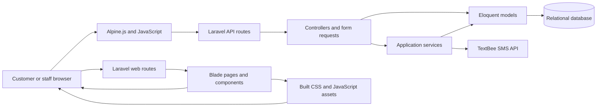
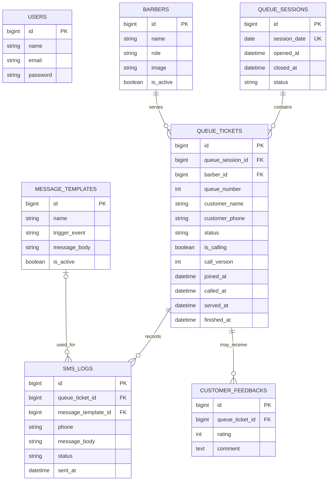

# Sidecut VQS System Architecture

**Document purpose:** Describe the current implementation of Sidecut VQS for project and technical documentation.

**Source reviewed:** Laravel application source, routes, Blade templates, JavaScript entry points, models, migrations, seeders, and configuration in this repository.

**Status:** Architecture description of the checked-in code as of 28 September 2026. This is not a deployment or security certification. Where the implementation is incomplete or has a portability constraint, that is called out explicitly.

## 1. System overview

Sidecut VQS is a Laravel 12 web application for a barbershop queue. It combines a server-rendered administration dashboard with JSON API endpoints. The browser receives Blade-rendered pages and uses Alpine.js and browser `fetch()` calls to read and update live queue data. Laravel uses Eloquent models to read and write the relational database. The queue workflow can call the external TextBee SMS API and save an audit record of each attempt.

The current code is organized as a **modular monolith**: the web pages, API, business rules, and persistence layer are in one Laravel application and are deployed as one system. The browser and database are separate runtime components, while TextBee is an external service.

### Main runtime components

| Component | Responsibility |
| --- | --- |
| Browser | Renders the user interface and performs interactions. Staff queue screens and the public calling board poll API endpoints approximately every three seconds. |
| Laravel web layer | Maps page URLs to Blade templates through `routes/web.php`. |
| Laravel API layer | Maps JSON endpoints to controllers through `routes/api.php`. |
| Blade and Alpine.js | Produces the HTML interface and manages page-level state, forms, polling, notifications, and display updates. |
| Controllers and requests | Validate input, coordinate application operations, query models, and return HTML or JSON responses. |
| Services | Encapsulate reusable work that integrates with another subsystem, such as queueing calculations or SMS delivery. |
| Eloquent and database | Map PHP models to relational tables and persist users, barbers, queue sessions, tickets, message templates, and SMS logs. |
| Vite | Builds the CSS and JavaScript entry points used by the Blade layouts. |
| TextBee | External SMS gateway called from the server using credentials stored in environment configuration. |

## 2. MVC architecture

MVC means **Model–View–Controller**. The pattern separates data and domain behavior, presentation, and request coordination. Laravel also supplies routing, validation, middleware, dependency injection, and database abstractions around MVC.

### Model

Models represent application data and relationships. They use Eloquent, Laravel's object-relational mapper (ORM), to query tables and save changes without writing SQL for every operation. Model casts convert database values into PHP dates, booleans, or integers; fillable fields control which attributes may be assigned in bulk.

Examples in this system:

- `QueueTicket` represents a customer's ticket and its status/timestamps. It belongs to a `QueueSession` and optionally to a `Barber`; it has many `SmsLog` records. It also exposes formatted queue-number and waiting-time attributes.
- `QueueSession` represents one queue day. Its `today()` method returns or creates today's session, and it has many tickets.
- `Barber` represents a staff member and has many queue tickets.
- `MessageTemplate` stores a named, enabled/disabled SMS template and its trigger event.
- `SmsLog` records the phone, message, result status, send time, ticket, and optional template associated with an SMS attempt.
- `User` is Laravel's authenticatable user model. The current route set does not yet provide a complete sign-in workflow.

Models live in `app/Models/`. Schema changes live in `database/migrations/`; seed data lives in `database/seeders/`; factories define generated test/example model states in `database/factories/`.

### View

Views present information to the user. This application uses Laravel Blade templates rather than a separate single-page application framework. Blade can render values supplied by a route/controller, include layout sections, and compose reusable components.

- Full pages are under `resources/views/pages/`.
- Shared layouts are under `resources/views/layouts/`.
- Reusable UI fragments are under `resources/views/components/` and are invoked as Blade components (for example, `<x-common.page-breadcrumb />`).
- Queue and dashboard templates contain page-level Alpine.js state and `fetch()` calls that consume the JSON API.
- Vite loads `resources/css/app.css` and `resources/js/app.js`; the latter starts Alpine.js and initializes chart, map, and calendar modules when their target elements exist.

The view layer is responsible for display and browser interaction. The server remains responsible for validating and applying persisted changes.

### Controller

Controllers accept routed HTTP requests, coordinate validation and models/services, then return a response. API controllers in `app/Http/Controllers/Api/` return JSON. `DashboardController` and `SidebarController` are examples of regular controllers, although most current page routes use short closures directly in `routes/web.php`.

Examples:

- `QueueTicketController` handles queue creation, live queue reads, call announcements, status changes, history, lookup, and SMS operations.
- `BarberController` handles barber listing and CRUD/toggle operations.
- `MessageTemplateController` handles message-template CRUD and enable/disable operations.
- `StatisticsController` builds summary, hourly, monthly, and barber-performance responses.
- `SmsLogController` returns a filtered, paginated SMS log.

### Supporting Laravel pieces

- **Routes** choose the controller/action or view for a URL.
- **Form Requests** validate incoming data before a controller action runs. Current request classes return `true` from `authorize()`, so they validate shape but do not enforce a user role or permission.
- **Middleware** runs before/after requests. Laravel's standard web middleware provides browser session and CSRF behavior. The API route is registered through Laravel's API routing configuration.
- **Dependency injection** supplies services such as `TextBeeService` and `QueueingCalculator` to controllers/commands.
- **Migrations** version the database schema so environments can build it consistently.

## 3. Complete MVC inventory

This inventory lists every PHP model file, every controller file, and every Blade view under `resources/views/` in the repository snapshot reviewed for this guide. View descriptions distinguish operational Sidecut pages from reusable UI examples inherited from the dashboard template.

### 3.1 Models — 6 files

| Model | File | Description |
| --- | --- | --- |
| `Barber` | `app/Models/Barber.php` | Barbershop staff member; stores name, role, optional image, and active status; has many queue tickets. |
| `MessageTemplate` | `app/Models/MessageTemplate.php` | Reusable SMS message definition with a trigger event and active flag. |
| `QueueSession` | `app/Models/QueueSession.php` | One dated queue session; creates or returns the session for today and has many tickets. |
| `QueueTicket` | `app/Models/QueueTicket.php` | Customer's queue entry, assigned barber, status, call state, and lifecycle timestamps; belongs to a session and barber, has many SMS logs. |
| `SmsLog` | `app/Models/SmsLog.php` | Audit entry for a sent, failed, or skipped message; belongs to a ticket and optionally a template. |
| `User` | `app/Models/User.php` | Laravel authenticatable user with notification support, fillable identity fields, hidden password/token, and hashed password cast. |

There is no `CustomerFeedback` or `Service` model in `app/Models/` in this snapshot. The feedback table is created by a migration, while services were later removed from the live queue schema.

### 3.2 Controllers — 9 files

| Controller | File | Description |
| --- | --- | --- |
| `Controller` | `app/Http/Controllers/Controller.php` | Shared Laravel base controller; defines no application action itself. |
| `DashboardController` | `app/Http/Controllers/DashboardController.php` | Its `index()` returns `pages.dashboard`; current `/` route instead returns `pages.dashboard.ecommerce`, so this action is not the route currently rendering the main dashboard. |
| `SidebarController` | `app/Http/Controllers/SidebarController.php` | Builds a static menu-group array and returns `components.sidebar`; no `components/sidebar.blade.php` exists in the view inventory, and this action is not registered in the current routes. |
| `BarberController` | `app/Http/Controllers/Api/BarberController.php` | JSON endpoints to list, create, update, activate/deactivate, and delete barbers; guards deletion when the barber has active tickets and stores optional images on the public disk. |
| `MessageTemplateController` | `app/Http/Controllers/Api/MessageTemplateController.php` | JSON CRUD and active-toggle operations for SMS templates. |
| `QueueSessionController` | `app/Http/Controllers/Api/QueueSessionController.php` | Scaffolded resource controller with empty index/store/show/update/destroy methods; it is not registered in the current API routes. |
| `QueueTicketController` | `app/Http/Controllers/Api/QueueTicketController.php` | Main queue API: active list, public board, ticket creation, call announcement, status changes, history, lookup, SMS send/log, and wait estimate. |
| `SmsLogController` | `app/Http/Controllers/Api/SmsLogController.php` | JSON endpoint that filters and paginates SMS delivery logs. |
| `StatisticsController` | `app/Http/Controllers/Api/StatisticsController.php` | JSON endpoints for daily metrics, queue-model results, hourly data, monthly totals, and barber performance. |

### 3.3 Page views — 23 files

| Blade view | Description |
| --- | --- |
| `resources/views/pages/auth/signin.blade.php` | Sign-in screen template; the view itself does not implement the login POST/session flow. |
| `resources/views/pages/auth/signup.blade.php` | Registration screen template; the view itself does not implement account creation. |
| `resources/views/pages/blank.blade.php` | Empty starter page for adding content. |
| `resources/views/pages/calender.blade.php` | Calendar page template; filename uses the existing `calender` spelling. |
| `resources/views/pages/chart/bar-chart.blade.php` | Bar-chart demonstration page. |
| `resources/views/pages/chart/line-chart.blade.php` | Line-chart demonstration page. |
| `resources/views/pages/customers.blade.php` | Public customer flow to select/join the queue and look up a ticket. |
| `resources/views/pages/dashboard/ecommerce.blade.php` | Main Sidecut dashboard page, assembling queue metrics and dashboard widgets. |
| `resources/views/pages/errors/error-404.blade.php` | Not-found error page template. |
| `resources/views/pages/form/form-elements.blade.php` | Page demonstrating form controls. |
| `resources/views/pages/messages.blade.php` | Messages page showing SMS logs and message-related management UI. |
| `resources/views/pages/profile.blade.php` | Profile page template with profile cards. |
| `resources/views/pages/queue-calling.blade.php` | Public calling-board page; polls for the current call and can announce ticket numbers in the browser. |
| `resources/views/pages/queue-control.blade.php` | Staff-facing live queue-control screen with polling, call, status, and SMS actions. |
| `resources/views/pages/queue.blade.php` | Queue page that composes queue-management/history table components. |
| `resources/views/pages/statistics.blade.php` | Statistics page that composes queue summary and chart/table components. |
| `resources/views/pages/tables/basic-tables.blade.php` | Page showing basic table examples. |
| `resources/views/pages/ui-elements/alerts.blade.php` | Alert component examples. |
| `resources/views/pages/ui-elements/avatars.blade.php` | Avatar component examples. |
| `resources/views/pages/ui-elements/badges.blade.php` | Badge component examples. |
| `resources/views/pages/ui-elements/buttons.blade.php` | Button component examples. |
| `resources/views/pages/ui-elements/images.blade.php` | Image display examples. |
| `resources/views/pages/ui-elements/videos.blade.php` | Video/embed examples. |

### 3.4 Layout views — 8 files

| Blade view | Description |
| --- | --- |
| `resources/views/layouts/app-header.blade.php` | Shared application header/navigation area. |
| `resources/views/layouts/app.blade.php` | Main dashboard shell: app header, sidebar, backdrop, content slot, and Vite assets. |
| `resources/views/layouts/backdrop.blade.php` | Mobile/sidebar backdrop overlay. |
| `resources/views/layouts/fullscreen-layout.blade.php` | Full-screen shell for pages that do not use the regular dashboard frame. |
| `resources/views/layouts/guest.blade.php` | Guest/public-facing page shell used outside the staff dashboard. |
| `resources/views/layouts/queue-board.blade.php` | Minimal full-screen layout for the public calling board. |
| `resources/views/layouts/sidebar-widget.blade.php` | Wrapper for sidebar-related widget content. |
| `resources/views/layouts/sidebar.blade.php` | Application sidebar/navigation menu. |

### 3.5 Reusable component views — 54 files

#### Calendar and shared components — 8 files

| Blade view | Description |
| --- | --- |
| `resources/views/components/calender-area.blade.php` | Calendar display area used by the calendar page. |
| `resources/views/components/common/common-grid-shape.blade.php` | Decorative grid background/shape. |
| `resources/views/components/common/component-card.blade.php` | Reusable card container for component examples/content. |
| `resources/views/components/common/dropdown-menu.blade.php` | Shared dropdown-menu markup. |
| `resources/views/components/common/page-breadcrumb.blade.php` | Page breadcrumb/header navigation component. |
| `resources/views/components/common/preloader.blade.php` | Loading/preloader overlay. |
| `resources/views/components/common/table-dropdown.blade.php` | Dropdown actions menu for table rows. |
| `resources/views/components/common/theme-toggle.blade.php` | Light/dark theme toggle control. |

#### Dashboard/ecommerce components — 11 files

| Blade view | Description |
| --- | --- |
| `resources/views/components/ecommerce/barber-performance.blade.php` | Chart/table widget for completed tickets by barber, loaded from the barber-performance API. |
| `resources/views/components/ecommerce/customer-demographic.blade.php` | Customer-demographic dashboard visualization/example. |
| `resources/views/components/ecommerce/ecommerce-metrics.blade.php` | Dashboard KPI cards that read barber and queue data. |
| `resources/views/components/ecommerce/monthly-report.blade.php` | Monthly report widget using completed-ticket totals. |
| `resources/views/components/ecommerce/monthly-sale.blade.php` | Monthly sales chart example from the dashboard template. |
| `resources/views/components/ecommerce/monthly-target.blade.php` | Monthly target/progress widget example. |
| `resources/views/components/ecommerce/queue-server-status.blade.php` | Queue/server status widget showing active barbers and queue state. |
| `resources/views/components/ecommerce/queue-stats-chart.blade.php` | Hourly queue volume/wait chart loaded from the hourly statistics API. |
| `resources/views/components/ecommerce/queue-usage.blade.php` | Queue utilization/usage widget combining queue, barber, and summary API data. |
| `resources/views/components/ecommerce/recent-orders.blade.php` | Recent-order table example from the upstream dashboard template; not the queue ticket table. |
| `resources/views/components/ecommerce/statistics-chart.blade.php` | General statistics chart example/widget. |

#### Form components — 13 files

| Blade view | Description |
| --- | --- |
| `resources/views/components/form/date-picker.blade.php` | Date-picker control integrated with the frontend date-picker library. |
| `resources/views/components/form/form-elements/checkbox-component.blade.php` | Checkbox control examples. |
| `resources/views/components/form/form-elements/default-inputs.blade.php` | Standard text/input examples. |
| `resources/views/components/form/form-elements/dropzone.blade.php` | Drag-and-drop file upload UI example. |
| `resources/views/components/form/form-elements/file-input-example.blade.php` | File input control example. |
| `resources/views/components/form/form-elements/input-group.blade.php` | Input with grouped labels/icons/actions examples. |
| `resources/views/components/form/form-elements/input-states.blade.php` | Input states such as normal, error, and disabled examples. |
| `resources/views/components/form/form-elements/radio-buttons.blade.php` | Radio-button group examples. |
| `resources/views/components/form/form-elements/select-inputs.blade.php` | Select/dropdown input examples. |
| `resources/views/components/form/form-elements/text-area-inputs.blade.php` | Text-area examples. |
| `resources/views/components/form/form-elements/toggle-switch.blade.php` | Toggle-switch examples. |
| `resources/views/components/form/input/radio.blade.php` | Reusable radio input component. |
| `resources/views/components/form/select/multiple-select.blade.php` | Reusable multiple-select control. |

#### Header and profile components — 5 files

| Blade view | Description |
| --- | --- |
| `resources/views/components/header/notification-dropdown.blade.php` | Header notifications dropdown. |
| `resources/views/components/header/user-dropdown.blade.php` | Header user/account dropdown. |
| `resources/views/components/profile/address-card.blade.php` | Profile address information card. |
| `resources/views/components/profile/personal-info-card.blade.php` | Profile personal-information card. |
| `resources/views/components/profile/profile-card.blade.php` | Profile summary card. |

#### Table components — 11 files

| Blade view | Description |
| --- | --- |
| `resources/views/components/tables/basic-tables/basic-tables-five.blade.php` | Fifth generic basic-table example. |
| `resources/views/components/tables/basic-tables/basic-tables-four.blade.php` | Fourth generic basic-table example. |
| `resources/views/components/tables/basic-tables/basic-tables-message-templates.blade.php` | Message-template table and browser-side create/edit/toggle/delete interactions. |
| `resources/views/components/tables/basic-tables/basic-tables-one.blade.php` | First generic basic-table example. |
| `resources/views/components/tables/basic-tables/basic-tables-queue-history.blade.php` | Paginated queue-history table loaded from the queue-history API. |
| `resources/views/components/tables/basic-tables/basic-tables-queue.blade.php` | Live queue table with call, status, and send-message actions. |
| `resources/views/components/tables/basic-tables/basic-tables-sms-logs.blade.php` | Paginated/filterable SMS log table. |
| `resources/views/components/tables/basic-tables/basic-tables-stats-summary.blade.php` | Queue statistics summary cards/table loaded from the summary API. |
| `resources/views/components/tables/basic-tables/basic-tables-three.blade.php` | Third generic basic-table example. |
| `resources/views/components/tables/basic-tables/basic-tables-two.blade.php` | Second generic basic-table example. |
| `resources/views/components/tables/basic-tables/tables-manage-servers.blade.php` | Barber management table with create/edit/active-toggle/delete interactions. |

#### UI components — 6 files

| Blade view | Description |
| --- | --- |
| `resources/views/components/ui/alert.blade.php` | Reusable alert/message presentation component. |
| `resources/views/components/ui/avatar.blade.php` | Reusable avatar display component. |
| `resources/views/components/ui/badge.blade.php` | Reusable status/label badge. |
| `resources/views/components/ui/button.blade.php` | Reusable button component. |
| `resources/views/components/ui/modal.blade.php` | Reusable modal dialog component. |
| `resources/views/components/ui/youtube-embed.blade.php` | Reusable YouTube video embed component. |

## 4. Data model

The main persisted domain is the daily queue. A session groups tickets for one calendar date; tickets can be assigned to barbers, move through a status lifecycle, and have related SMS log entries.

`queue_number` is unique within a queue session, and `session_date` is unique in `queue_sessions`. A barber may be null on a ticket. The latest migration removes the earlier `service_id` from queue tickets and drops the services table, so services are not currently part of the live queue model.

The initial schema also creates `customer_feedbacks`, but there is no corresponding Eloquent model or API workflow in the reviewed code. The `User` and Sanctum personal access token tables are framework support and are separate from queue operations.

## 5. Request and data flows

### 4.1 Page rendering

1. The browser requests a URL such as `/queue` or `/statistics`.
2. `routes/web.php` matches the URL and returns a Blade view, often with a page title.
3. Blade composes the page with the shared layout and components.
4. The layout references Vite-built CSS/JavaScript assets.
5. Alpine.js initializes page state. A data-driven page makes one or more API requests to load current data.

This keeps route/page rendering in Laravel while allowing the browser to update queue widgets without reloading the whole page.

### 4.2 Customer joins the queue

1. The customer page loads active barbers from `GET /api/barbers`.
2. The form checks that name and phone are present and roughly valid in the browser.
3. It sends `POST /api/queue` with the customer's name, phone, and optional barber ID.
4. `StoreQueueTicketRequest` validates required fields, phone format, and that an optional barber exists.
5. `QueueTicketController` rejects the request if no barber is active. It finds/creates today's `QueueSession`.
6. If no barber was selected, it assigns the active barber with the fewest current `in_queue`/`serving` tickets.
7. It allocates the next queue number for the session, saves a ticket in `in_queue` status, and calculates a simple estimated wait (15 minutes times the current waiting-ticket count).
8. It attempts the configured join SMS through `TextBeeService`, writes the success/failure/skipped outcome to `sms_logs`, and returns the ticket plus estimated wait as JSON.
9. The browser displays the confirmation and queue number.

### 4.3 Staff manages and calls tickets

1. The manage-queue page requests today's active tickets with `GET /api/queue` and barber data with `GET /api/barbers`.
2. The page refreshes these data about every three seconds and can filter the visible tickets by barber.
3. Calling a ticket sends `POST /api/queue/{ticket}/call`. The server only allows today's waiting ticket when at least one barber is active. In a database transaction, it clears the previous current-call flag for that session and marks this ticket as calling, records `called_at`, and increments `call_version`.
4. Changing status sends `PATCH /api/queue/{ticket}/status`. The validated statuses are `in_queue`, `serving`, `completed`, and `canceled`. The controller records `served_at` when service starts and `finished_at` for completed/canceled tickets, clears the calling flag, and triggers the completion SMS when appropriate.
5. A manual queue message uses `POST /api/queue/{ticket}/sms` and the in-queue status-update template.
6. The calling-board page independently polls `GET /api/queue/calling-board`. It displays the current call, recent calls, upcoming tickets, and waiting count. A change in ticket ID or `call_version` can trigger a browser speech announcement if the user enabled it.
7. Queue history is returned by `GET /api/queue/history` with optional date/range filters and pagination.

### 4.4 SMS delivery and audit trail

`TextBeeService` compiles `{{variable}}` placeholders in a `MessageTemplate`, then sends the resulting text to the TextBee endpoint using the API key from `services.textbee` configuration. Credentials are intended to come from environment variables (`TEXTBEE_ENDPOINT`, `TEXTBEE_API_KEY`). The queue controller catches delivery errors and records a log entry. If a template is missing or inactive, the attempt is recorded as `skipped`; successful and failed sends are recorded as `sent` and `failed`. `GET /api/sms-logs` returns a paginated log, optionally filtered by date and status.

SMS calls currently happen synchronously during the HTTP request. A slow or unavailable gateway can therefore add response time, although the client call has a ten-second timeout. A queued job would be a future option if asynchronous delivery becomes necessary.

### 4.5 Statistics

`StatisticsController` queries the current and historical ticket/session data and returns JSON for the dashboard charts and summary cards:

- Today's total tickets, average waiting time, average service time, and completion rate.
- A queue-theory estimate using an M/M/S model in `QueueingCalculator`, where active barbers are servers, arrival/service rates are estimated from ticket data, and the controller returns stability, utilization, expected queue length, and predicted wait.
- Hourly ticket counts and average wait grouped into shop hours (11:00–22:00) over a date range.
- Monthly completed-ticket totals for the current year.
- Completed-ticket counts per barber for a requested date range.

These values are estimates derived from the available ticket records; they are not a separate forecasting service.

## 6. HTTP interface

### Web pages

`routes/web.php` maps page URLs such as `/`, `/queue`, `/queue-control`, `/queue-calling`, `/customers`, `/messages`, and `/statistics` to Blade views. It also exposes calendar, profile, chart, form, table, authentication-example, error, and UI-component pages. These routes mainly render pages; queue and management data operations are performed through API endpoints.

### JSON API

Routes in `routes/api.php` are prefixed with `/api` by Laravel.

| Endpoint group | Main operations | Purpose |
| --- | --- | --- |
| `/api/barbers` | `GET`, `POST`, `PUT`, `PATCH .../toggle-active`, `DELETE` | List and manage barbers. |
| `/api/queue` | `GET`, `POST`, `GET .../history`, `GET .../calling-board`, `GET .../lookup`, `POST .../{id}/call`, `PATCH .../{id}/status`, `POST .../{id}/sms` | Manage daily tickets, customer joining/lookup, history, live calling, status changes, and SMS. |
| `/api/message-templates` | `GET`, `POST`, `PUT/PATCH`, `DELETE`, `PATCH .../{id}/toggle-active` | Manage SMS content and whether templates are active. |
| `/api/stats` | `GET /summary`, `/hourly`, `/monthly-report`, `/barber-performance` | Supply dashboard statistics. |
| `/api/sms-logs` | `GET` | List/filter SMS attempts. |
| `/api/user` | `GET` | Return the current user; this endpoint alone is explicitly assigned `auth:sanctum` in this route file. |

The `QueueSessionController` contains scaffolded resource methods but is not registered in the current API route file.

## 7. Security and operational boundaries

- API request validation is implemented for queue tickets, barber data, message templates, and ticket status values. Browser validation improves usability; server validation is the authoritative check.
- The API routes for queue operations, barber/template administration, statistics, and SMS logs are not wrapped in authentication middleware in the current `routes/api.php`. `GET /api/user` is protected by Sanctum, but that does not protect the other routes. The Form Request `authorize()` methods also currently allow requests. Access control should be added before exposing management endpoints publicly.
- The browser sends customer names and phone numbers to the Laravel API; these are stored with queue tickets. SMS logs also retain phone numbers and message text. Production retention and access policies should account for this personal data.
- TextBee secrets belong in deployment environment variables, never in source-controlled files or browser JavaScript.
- Uploaded barber images are stored through Laravel's `public` filesystem disk. A production deployment needs persistent/object storage or another strategy if the runtime filesystem is ephemeral.
- Queue API reads are polled by browser timers; this is near-real-time polling, not WebSockets or server-sent events.

## 8. Technology and configuration

- **Backend:** PHP 8.2+, Laravel 12, Eloquent ORM, Laravel Sanctum package.
- **Frontend:** Blade, Alpine.js, Tailwind CSS 4, Vite 7, and JavaScript chart/calendar/date-picker libraries.
- **Database:** `.env.example` selects MySQL. `config/database.php` also defines SQLite and PostgreSQL connections.
- **Sessions, cache, and queue:** `.env.example` configures database-backed session, cache, and queue drivers. The queue system is configured, but SMS currently sends inline and no SMS job class is present in the reviewed source.
- **External integration:** TextBee SMS via Laravel's HTTP client.
- **Build:** `npm run build` compiles assets; Composer scripts include Laravel setup and test commands.

## 9. Portability and known implementation gaps

These details matter when maintaining or deploying the documented system:

1. **PostgreSQL/Supabase needs database portability work.** Although Laravel's PostgreSQL connection is configured, current migrations and query code include MySQL-specific elements: enum column alterations with `ALTER TABLE ... MODIFY`, column ordering with `after()`, `TIMESTAMPDIFF`, and `MONTH(...)`. These should be rewritten or tested against PostgreSQL before using Supabase as the production database.
2. **Vercel PHP is a community runtime.** This Laravel app uses server-side routing and state and writes uploaded images through a filesystem disk. Vercel Functions have an ephemeral/read-only deployment filesystem apart from temporary storage, so persistent uploads and other runtime writes need an external store. A conventional Laravel application host is operationally simpler; Vercel deployment needs an explicit compatibility pass.
3. **Authentication pages are currently templates.** `/signin` and `/signup` render views, but the reviewed route file does not define login/registration submission routes. Sanctum's protected `/api/user` endpoint exists, but there is no visible end-to-end login/session flow in this route set.
4. **Administrative APIs currently lack route-level access checks.** Add authentication and role/policy authorization before exposing staff operations.
5. **Some persisted concepts are not wired through.** A customer-feedback table migration exists without a corresponding model or API workflow. A services table was later dropped from the current schema; a `ServiceFactory` remains in the repository.
6. **SMS template IDs are assumed in queue logic.** Join, status-update, and completion flows refer to template IDs 1, 2, and 3. Seed data creates templates by name and may not guarantee those IDs on an existing database; deployments should verify seeded/configured template records or replace ID assumptions with a stable lookup.
7. **Some state and concurrency rules are only partially enforced.** The status request checks that the new value is allowed, but does not enforce every prior-to-next status transition. Queue numbers are allocated with `max(queue_number) + 1`; the database's unique constraint prevents duplicate persisted numbers, but simultaneous joins can contend and one insert may need a retry strategy.
8. **Small route/schema cleanup items exist.** `/blank` is registered twice in `routes/web.php`. The customer-feedback migration's `down()` method drops `customer_feedback`, while its `up()` creates `customer_feedbacks`; rollback behavior should be corrected if that migration is used. The queue-control JavaScript checks for an `sms_status` field in the status-update response, but the controller currently returns the ticket without that field.

## 10. Source map for maintainers

| Concern | Source directory/file |
| --- | --- |
| Browser routes | `routes/web.php` |
| JSON API routes | `routes/api.php` |
| Page/controller actions | `app/Http/Controllers/` |
| API validation | `app/Http/Requests/` |
| Eloquent models | `app/Models/` |
| Domain/integration services | `app/Services/` |
| Blade pages | `resources/views/pages/` |
| Shared layouts and components | `resources/views/layouts/`, `resources/views/components/` |
| Browser JavaScript | `resources/js/`, plus page-level Alpine definitions in Blade |
| Database schema | `database/migrations/` |
| Sample data | `database/seeders/`, `database/factories/` |
| Runtime configuration | `config/`, `.env.example` |
| Frontend asset pipeline | `vite.config.js`, `package.json` |

## 11. Typical development lifecycle

1. Install PHP dependencies with Composer and JavaScript dependencies with npm.
2. Configure `.env` for the chosen database, app URL/key, and any external services.
3. Run migrations to create/update schema; use seeders only when sample data is desired.
4. Start Laravel and Vite during development (the Composer `dev` script starts Laravel, a queue listener, log tailing, and Vite).
5. Edit Blade, PHP, or JavaScript source. Vite rebuilds frontend assets during development or with `npm run build` for production.
6. Deploy the app with its environment variables, persistent database, and storage configuration. Run migrations as a controlled release step.

## References

- [Laravel 12 documentation](https://laravel.com/docs/12.x)
- [Laravel Blade templates](https://laravel.com/docs/12.x/blade)
- [Laravel Eloquent ORM](https://laravel.com/docs/12.x/eloquent)
- [Laravel validation](https://laravel.com/docs/12.x/validation)
- [Laravel Sanctum](https://laravel.com/docs/12.x/sanctum)
- [Vite documentation](https://vite.dev/guide/)
- [Supabase Laravel quickstart](https://supabase.com/docs/guides/getting-started/quickstarts/laravel) (relevant if PostgreSQL hosting is selected; see portability notes above)
- [Vercel runtime documentation](https://vercel.com/docs/functions/runtimes) (relevant if Vercel is selected; see portability notes above)
